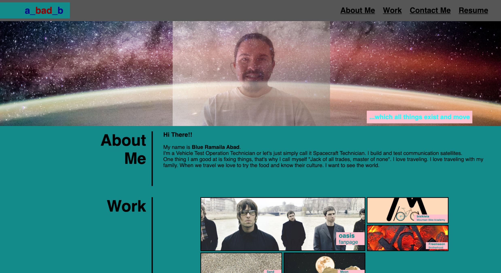

# professional-portfolio-blue
This is the introduction for Advance CSS.

On this challenge, I used all things i learned from html, css and git skills

## Built with:
HTML

CSS

## Website: https://bibo1011.github.io/professional-portfolio-blue/

## Screenshot:

